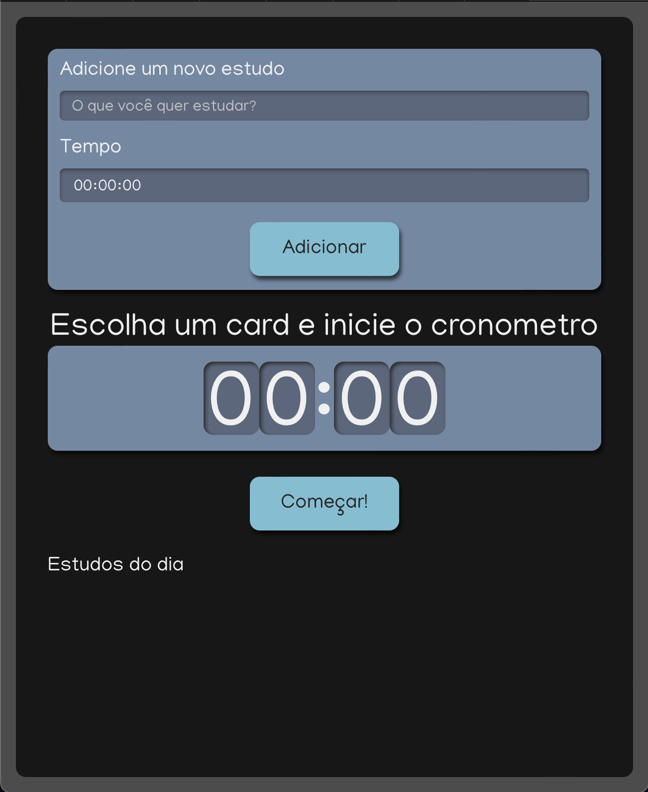

<div align="center">
  <h1>🎯 My Alura Studies</h1>
  <p align="center">
    <a href="#-sobre">Sobre</a>&nbsp;&nbsp;&nbsp;|&nbsp;&nbsp;&nbsp;
    <a href="#-tecnologias">Tecnologias</a>&nbsp;&nbsp;&nbsp;|&nbsp;&nbsp;&nbsp;
    <a href="#-como-executar">Como Executar</a>&nbsp;&nbsp;&nbsp;|&nbsp;&nbsp;&nbsp;
    <a href="#-licença">Licença</a>
</p>
   
</div>


## 📚 Sobre

O projeto My Alura Studies consiste em um sistema de controle para estudos. Nele, você pode adicionar tarefas/objetivos e cronometrar seu tempo para melhor foco e aprendizado.

## 🚀 Tecnologias utilizadas:

- ReactJS
- Typescript
- Javascript

## ⏱ Como executar

```bash
# Clonar o repositório
$ git clone https://github.com/polyanetuag/my-alura-studies.git
# Entrar na pasta
$ cd my-alura-studies

# Instalar as dependências
$ yarn

# Iniciar o servidor
$ yarn start

```

## 📝 Licença

Esse projeto está sob a licença MIT.

---

Desenvolvido com 💜 por Polyane Tuag
